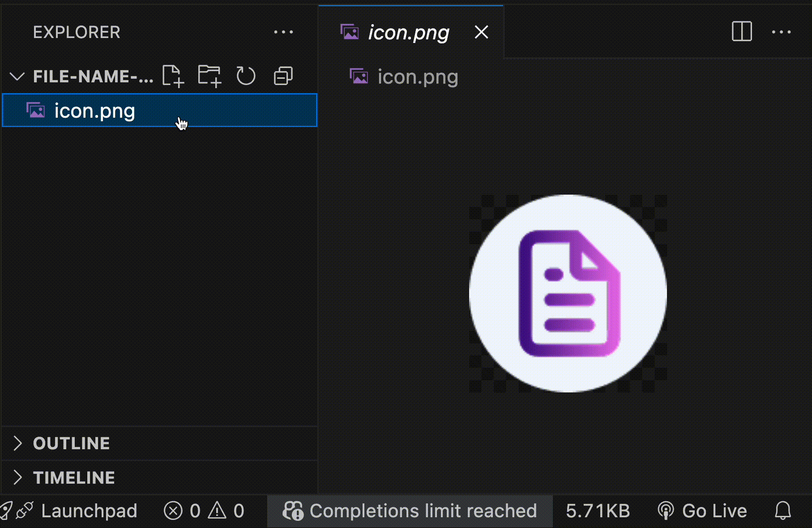

# File Name Linter

Helps enforce **hyphen-case** naming rules for resource files. When a file name doesn't follow the rule, it shows an info message suggesting the correct format.

## Features

- Shows an info message when a file name doesn't follow hyphen-case naming
- Supports the following file extensions:
  `.png`, `.jpg`, `.jpeg`, `.svg`, `.gif`, `.webp`,  
  `.mp3`, `.wav`, `.mp4`, `.webm`,  
  `.woff`, `.woff2`, `.ttf`, `.pdf`,  
  `.json`, `.csv`

## Requirements

- VS Code version **1.98.0** or higher

## Backlog

- Allow selecting different naming rules per file extension
- Support custom user-defined naming settings

## Release Notes

### 0.0.1

- Initial release
